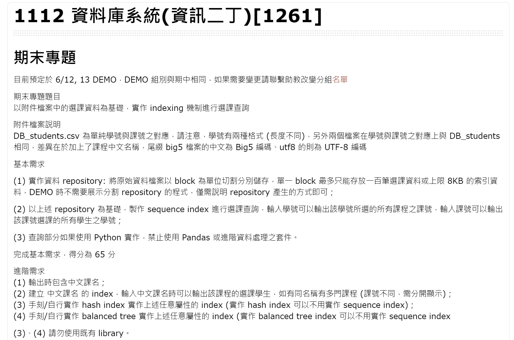

# DB_Indexing
以選課資料為基礎，實作 indexing 機制進行選課查詢。

## 題目說明


## 設定環境

### Vscode Python 虛擬環境

### 建立虛擬環境
```
python -m venv venv
```

#### 啟動虛擬環境
```
.\venv\Scripts\Activate.ps1
```

#### 安裝套件
```
pip install -r .\env\requirements.txt
```

#### 關閉虛擬環境
```
deactivate
```

### Python 套件清單

#### pip 生成 requirements.txt

```
pip freeze > .\env\requirements.txt
```

#### pip 使用 requirements.txt

```
pip install -r .\env\requirements.txt
```

